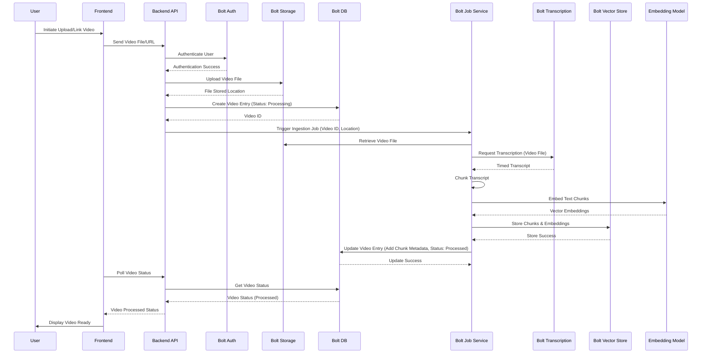
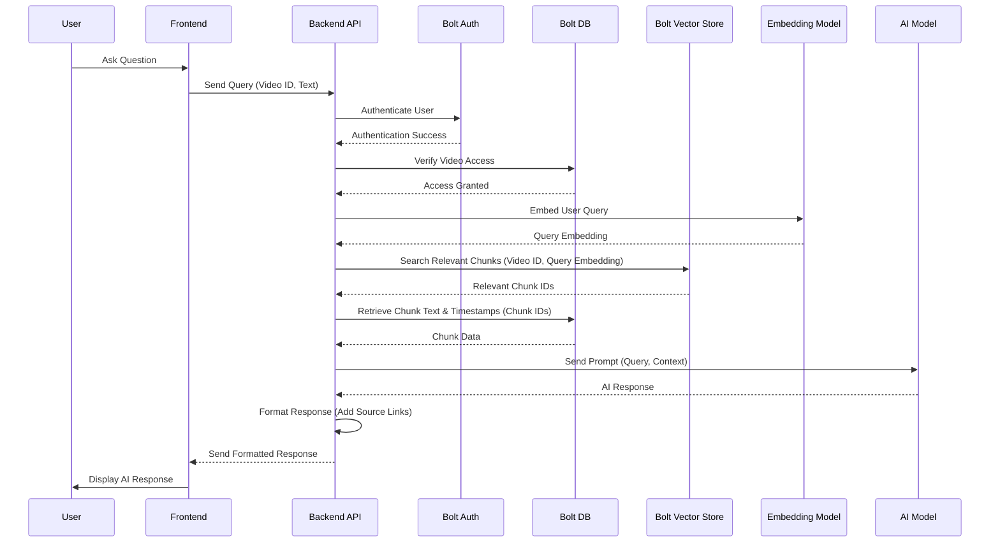
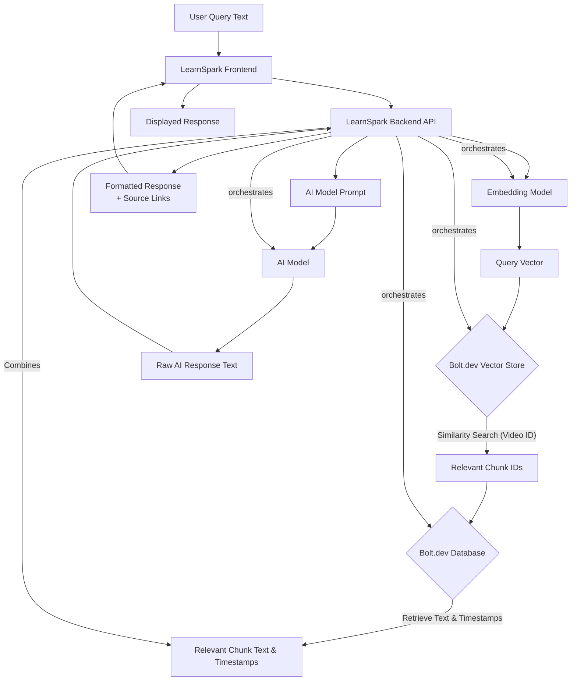

```markdown
# LearnSpark System Flow Document

**Project:** LearnSpark - The Active Learning AI Companion
**Version:** 1.0
**Date:** June 6, 2025

## 1. System Overview

LearnSpark is designed to transform video consumption into an active learning experience. The system is built upon a foundation of Bolt.dev services, orchestrated by a backend API layer, and accessed via a user-friendly frontend dashboard.

**Core Components:**

*   **LearnSpark Frontend (UI):** The user-facing web application (dashboard) providing the video player, dynamic transcript, chat interface, quiz module, and video management features.
*   **LearnSpark Backend API:** Serverless endpoints responsible for handling user requests, interacting with Bolt.dev services, orchestrating the ingestion pipeline, and managing data flow.
*   **Bolt.dev Authentication:** Manages user registration, login, and session management.
*   **Bolt.dev File Storage:** Securely stores uploaded video files and potentially intermediate processing outputs.
*   **Bolt.dev Background Job Service:** Executes long-running, asynchronous tasks, primarily the video ingestion pipeline.
*   **Bolt.dev Transcription Service (Whisper):** Transcribes audio content from videos into text.
*   **Bolt.dev Vector Store:** Stores vector embeddings of video text chunks for semantic search and retrieval (RAG).
*   **Bolt.dev Database:** Stores structured data such as user profiles, video metadata (title, duration, processing status), chunk information (timestamp, text, vector ID), quiz questions, and user progress.
*   **AI Model (External/Bolt.dev integrated):** A Large Language Model (LLM) used by the Backend API for generating chat responses based on retrieved context and for generating quiz questions/answers.

**High-Level Interactions:**

1.  Users interact with the Frontend.
2.  Frontend communicates with the Backend API for data retrieval, action triggering (upload, chat query, quiz generation).
3.  Backend API uses Bolt.dev Authentication for user validation.
4.  Backend API orchestrates the video ingestion process via Bolt.dev Background Jobs, utilizing File Storage, Transcription, Vector Store, and Database.
5.  For interactive features (Chat, Quiz), the Backend API retrieves relevant data from the Bolt.dev Vector Store and Database, then interacts with the AI Model.
6.  Results from Backend API calls (including AI responses) are sent back to the Frontend for display.

## 2. User Workflows

This section outlines the primary user journeys through the LearnSpark system.

### 2.1 Workflow: Uploading & Processing a Video

This is the core ingestion process, initiated by the user.

**Steps:**

1.  User logs in via the Frontend (using Bolt.dev Auth).
2.  User initiates video upload/linking via the Frontend UI.
3.  Frontend sends the video file or URL to the Backend API.
4.  Backend API validates the user and request.
5.  Backend API uploads the video file to Bolt.dev File Storage or initiates external download.
6.  Backend API creates an entry in the Bolt.dev Database for the video with a "Processing" status.
7.  Backend API triggers a new job in the Bolt.dev Background Job Service, passing video ID and storage location.
8.  The Background Job executes the Smart Ingestion Pipeline:
    *   Retrieves video from Bolt.dev File Storage.
    *   Sends video (or audio stream) to Bolt.dev Transcription Service (Whisper).
    *   Receives timed transcript from Transcription Service.
    *   Segments the transcript into meaningful chunks.
    *   Generates vector embeddings for each chunk using an embedding model.
    *   Stores chunks and their vector embeddings in the Bolt.dev Vector Store.
    *   Updates the Bolt.dev Database with chunk metadata (text, timestamps, vector ID, video ID).
    *   Updates the video status in the Bolt.dev Database to "Processed" (or "Failed").
9.  Frontend periodically polls the Backend API for the video's processing status or receives a push notification (if implemented) and updates the UI.
10. Once processed, the video and its associated data (transcript, ready for interaction) are available in the dashboard.

**Mermaid Diagram: Video Ingestion Workflow**



### 2.2 Workflow: Interacting with Processed Video (Chat)

Users ask questions about the video content.

**Steps:**

1.  User views a processed video in the Frontend dashboard.
2.  User types a question in the chat interface.
3.  Frontend sends the user query and video ID to the Backend API.
4.  Backend API validates the user and access to the video (using Bolt.dev Auth and DB).
5.  Backend API performs Retrieval Augmented Generation (RAG):
    *   Embeds the user query using the Embedding Model.
    *   Queries the Bolt.dev Vector Store to find the most relevant text chunks from the video (associated with the video ID) based on vector similarity.
    *   Retrieves the full text of the relevant chunks and their associated timestamps from the Bolt.dev Database.
6.  Backend API constructs a prompt for the AI Model, including the user query and the retrieved video text context.
7.  Backend API sends the prompt to the AI Model.
8.  AI Model generates a response based *only* on the provided context.
9.  Backend API processes the AI response, extracting or identifying the specific chunks/timestamps used by the AI.
10. Backend API formats the response, including the AI text and generated source links (pointing to specific timestamps in the video).
11. Backend API sends the formatted response to the Frontend.
12. Frontend displays the AI response in the chat, making source links clickable to jump to the corresponding video timestamps.

**Mermaid Diagram: Chat Interaction Workflow**



### 2.3 Workflow: Generating & Taking a Quiz

Users test their understanding with automatically generated quizzes.

**Steps:**

1.  User views a processed video in the Frontend dashboard.
2.  User requests a quiz via the Frontend UI.
3.  Frontend sends a request (including video ID, maybe desired length) to the Backend API.
4.  Backend API validates the user and access.
5.  Backend API retrieves necessary data from Bolt.dev Database (e.g., chunk text, timestamps for the video).
6.  Backend API constructs a prompt for the AI Model, requesting quiz questions and answer options based on the provided text context.
7.  Backend API sends the prompt to the AI Model.
8.  AI Model generates multiple-choice questions, correct answers, and plausible incorrect answers based on the video content.
9.  Backend API processes the AI response, associates questions/answers with relevant video timestamps/chunks, and stores the quiz data in the Bolt.dev Database (e.g., linked to the user or session).
10. Backend API sends the quiz questions and options to the Frontend.
11. Frontend displays the quiz to the user.
12. User submits answers via the Frontend.
13. Frontend sends submitted answers to the Backend API.
14. Backend API validates answers against stored correct answers in the Bolt.dev Database.
15. Backend API calculates the score and retrieves the associated video source links for review.
16. Backend API sends the results (score, correct answers, explanations, source links) back to the Frontend.
17. Frontend displays the quiz results, allowing users to click links to review relevant parts of the video.

## 3. Data Flows

This section details the movement and transformation of data within the system.

### 3.1 Ingestion Data Flow

Describes the path of video data and derived information during processing.

```mermaid
flowchart TD
    A[Video File/URL] --> B{Bolt.dev File Storage};
    B --> C[Bolt.dev Background Job];
    C --> D[Bolt.dev Transcription Service];
    D --> E[Timed Transcript Text];
    E --> F[Chunking Logic];
    F --> G[Text Chunks];
    G --> H[Embedding Model];
    H --> I[Vector Embeddings];
    I --> J{Bolt.dev Vector Store};
    G --> K[Metadata Extraction (Timestamp, Video ID)];
    K --> L{Bolt.dev Database};
    J --> L;
    L --> M[Processed Video Metadata<br>Chunk Data];

    subgraph Ingestion Pipeline
        C -- orchestrates --> D;
        C -- orchestrates --> F;
        C -- orchestrates --> H;
        C -- orchestrates --> J;
        C -- orchestrates --> K;
    end
```

**Explanation:**

1.  The initial video (A) is stored in Bolt.dev File Storage (B).
2.  A Bolt.dev Background Job (C) retrieves the video.
3.  The Job sends the video content to Bolt.dev Transcription (D), which returns the Timed Transcript Text (E).
4.  The Job applies Chunking Logic (F) to segment the transcript into Text Chunks (G).
5.  Text Chunks (G) are sent to an Embedding Model (H) to generate Vector Embeddings (I).
6.  Both Text Chunks (G) (or references to them) and their Vector Embeddings (I) are stored in the Bolt.dev Vector Store (J) for semantic search.
7.  Metadata (K) related to the video and chunks (timestamps, video ID, chunk text) is extracted from the Chunks (G) and stored in the Bolt.dev Database (L). The Vector Store also stores references to the database entries (J -> L).
8.  The Bolt.dev Database (L) acts as the central source of truth for processed video metadata and chunk information (M).

### 3.2 Interaction Data Flow (Chat Example)

Describes the movement of query and response data during user interaction.



**Explanation:**

1.  The User Query Text (A) is sent from the Frontend (B) to the Backend API (C).
2.  The Backend API (C) uses the Embedding Model (D) to convert the query into a Query Vector (E).
3.  The Backend API uses the Query Vector (E) to perform a similarity search in the Bolt.dev Vector Store (F), constrained by the video ID, resulting in Relevant Chunk IDs (G).
4.  The Backend API uses the Relevant Chunk IDs (G) to retrieve the corresponding Chunk Text & Timestamps (I) from the Bolt.dev Database (H).
5.  The Backend API (C) combines the original User Query Text (A) and the Relevant Chunk Text & Timestamps (I) into an AI Model Prompt (J).
6.  The Backend API sends the Prompt (J) to the AI Model (K), which returns the Raw AI Response Text (L).
7.  The Backend API (C) processes the Raw AI Response Text (L), identifies the sources, and creates a Formatted Response (M) including source links.
8.  The Formatted Response (M) is sent back to the Frontend (B) and displayed to the user as N[Displayed Response].

## 4. Error Handling

Robust error handling is critical for reliability, especially in asynchronous processing.

**General Strategies:**

*   **Logging and Monitoring:** Implement comprehensive logging across all components (Frontend, Backend, Background Jobs) and integrate with a monitoring system to detect failures and performance issues.
*   **Retry Mechanisms:** Implement automatic retries for transient errors (network issues, temporary service unavailability) in API calls and background job steps. Use exponential backoff.
*   **Dead Letter Queues (DLQ):** For background jobs that fail persistently after retries, send them to a DLQ for manual inspection and potential reprocessing.
*   **Idempotency:** Design API endpoints and background job steps to be idempotent where possible, to handle retries safely without side effects.
*   **User Notifications:** Inform users about critical failures that affect their ability to use the system (e.g., video ingestion failed, quiz generation failed).
*   **Graceful Degradation:** If an external service (like the AI Model) is temporarily unavailable, the system should degrade gracefully (e.g., inform the user chat is unavailable, but other features work).

**Specific Error Scenarios & Handling:**

*   **File Upload Failure:** Frontend displays an error message. Backend logs the failure.
*   **Bolt.dev Storage Error:** Backend/Job retries. Persistent errors are logged and potentially fail the job.
*   **Bolt.dev Authentication/Authorization Failure:** Backend returns 401/403. Frontend prompts re-authentication or denies access.
*   **Bolt.dev Transcription Failure:** Background job step retries. Persistent failure marks the video as "Processing Failed" in the DB, sends job to DLQ. User notified.
*   **Chunking/Embedding Failure:** Similar handling to Transcription Failure.
*   **Bolt.dev Vector Store Error:** Backend/Job retries. Persistent errors impact RAG/ingestion, handled accordingly.
*   **Bolt.dev Database Error:** Critical failure. Retries implemented in Backend/Job. Persistent errors require immediate attention and potentially halt processing/requests.
*   **AI Model API Failure (Timeout, Error):** Backend retries the AI call. Persistent failure results in an error response to the Frontend (e.g., "Could not generate response/quiz at this time"). Backend logs the error.
*   **Malformed Video Input:** Ingestion job detects invalid format, marks video as failed in DB, logs error, potentially sends to DLQ. User notified.

## 5. Security Flows

Ensuring the security and privacy of user data and video content is paramount.

### 5.1 Authentication

Verifying the identity of users accessing the system.

**Flow:**

1.  User interacts with the Frontend (e.g., attempts to log in or access protected data).
2.  Frontend sends authentication request (e.g., username/password, token) to the Backend API.
3.  Backend API forwards the request or validates the token against Bolt.dev Authentication service.
4.  Bolt.dev Authentication verifies credentials/token.
5.  If successful, Bolt.dev Authentication issues/validates a token (e.g., JWT) and sends it to the Backend API.
6.  Backend API uses this token to establish an authenticated session context.
7.  Backend API sends a success response and the token (if applicable for session management) back to the Frontend.
8.  Frontend stores the token securely (e.g., HTTP-only cookie, secure local storage) for subsequent requests.
9.  For all subsequent protected requests, the Frontend includes the token.
10. Backend API intercepts protected requests and validates the token with Bolt.dev Authentication before processing the request.

### 5.2 Authorization

Ensuring authenticated users only access resources they are permitted to view or modify (e.g., their own uploaded videos).

**Flow:**

1.  Authenticated User makes a request to the Backend API for a specific resource (e.g., `/videos/{video_id}`, `/chat`, `/quiz`).
2.  Backend API first authenticates the user via the token (as described above).
3.  Once authenticated, the Backend API retrieves the user's identity.
4.  For resource-specific requests (like accessing video data), the Backend API queries the Bolt.dev Database to check if the authenticated user is associated with the requested `video_id`.
5.  The Bolt.dev Database query confirms or denies the user's ownership/access rights to the specific video resource.
6.  Based on the database response, the Backend API either:
    *   Processes the request and returns the data (if authorized).
    *   Returns a 403 Forbidden error (if unauthorized).
7.  Frontend receives the response and updates the UI accordingly (displays data or shows an error message).

### 5.3 Data Security Considerations

*   **Data Isolation:** Ensure users' video data, transcripts, vectors, and quizzes are strictly isolated and accessible only to the owning user(s) or authorized parties. This is enforced by the Authorization flow described above.
*   **Encryption at Rest:** Bolt.dev services (File Storage, Database, Vector Store) should be configured to encrypt data at rest.
*   **Encryption in Transit:** All communication between Frontend and Backend API, and between Backend API and Bolt.dev services, should use TLS/SSL (HTTPS).
*   **API Security:** Implement API gateway protections, input validation, and rate limiting to protect Backend endpoints.
*   **Credential Management:** Avoid storing sensitive credentials directly in application code. Leverage Bolt.dev's managed secrets or environment variables securely.
*   **Third-Party AI Model:** Understand the data retention and privacy policies of the AI Model provider. Ensure sensitive user/video data is not retained by the LLM provider unless explicitly required and permitted. The RAG approach helps by sending only necessary context, not the entire video/user history.

```
```
